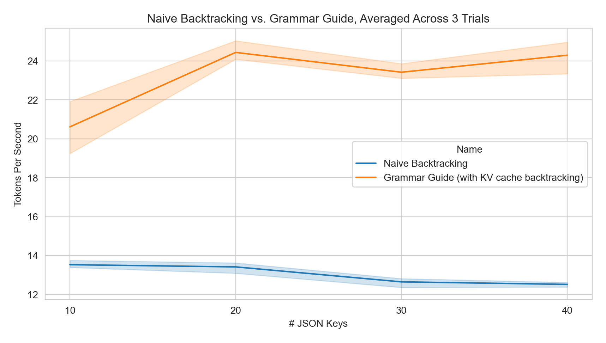
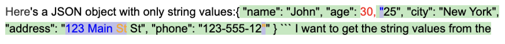
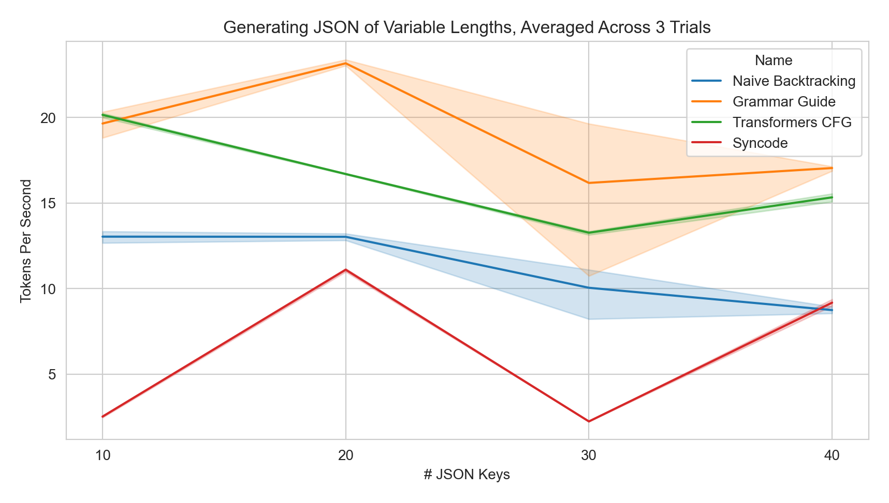

<div align="center"><h1> Grammar Guide </h1>
    Speculative grammar backtracking algorithm to perform grammar-constrained decoding with <i>any</i> text generation function (OpenAI, Anthropic, etc.)
</div>

---

This repo is a slightly modified implementation of the decoding mechanism described in Section 3.2 of [Grammar Prompting for Domain-Specific Language
Generation with Large Language Models](https://arxiv.org/pdf/2305.19234) by [@berlino](https://github.com/berlino). I refer to the general algorithm as **speculative grammar backtracking**.

It is a form of constrained decoding, and can be used to guide even proprietary, black-box LLM APIs according to some context-free grammar. It's rooted in the idea that as LLMs get better, not *all* steps of the decoding process need to apply a strict logit mask - like a good teacher, we let the student give an answer, and only intervene and correct when necessary.

When using local Transformer models, we can efficiently backtrack the KV cache according to a given Lark CFG. Below is a benchmark showing tokens/sec when generating a JSON object with [10, 20, 30, 40] keys using [HuggingFaceTB/SmolLM-135M](https://huggingface.co/HuggingFaceTB/SmolLM-135M) on my Macbook M1.

### Features
- Compatible with *any* text generation function
  - OpenAI, Anthropic etc. - as long as you can provide some `generate(prompt: str) -> str` function!
- Efficient re-use of KV cache for all CausalLM Transformer models
  - Optimistic, speculative decoding = no need to manually update to support new tokenizers
- Visualization and logging of grammar corrections
- Token healing to ensure high probability continuations

```
pip install grammar-guide
```
## Examples
- [With Anthropic](./examples/anthropic-gg.ipynb)
- [With OpenAI](./examples/openai-gg.ipynb)
- [With Transformers](./examples/transformers-gg.ipynb)

### With Transformer Models
When using HuggingFace Transformer models, we get an extra speed boost by leveraging efficient caching and backtracking of the KV cache. When a grammar correction is made, we backtrack to the state of the KV cache aligned to the longest prefix that is valid under our Lark context-free grammar.
```python
from transformers import AutoModelForCausalLM, AutoTokenizer
import guidance

import grammar_guide as gg

model_name_or_path = "HuggingFaceTB/SmolLM-135M"
model = AutoModelForCausalLM.from_pretrained(model_name_or_path)
tokenizer = AutoTokenizer.from_pretrained(model_name_or_path)
parser = gg.load_parser("../grammars/json_five_values_string_only.lark")

res = gg.guide(
  draft_model=model,
  tokenizer=tokenizer,
  parser=parser,
  prompt="Here's a JSON object with only string values:",
  target_model=guidance.models.Transformers(
      model_name_or_path, echo=False
  ),
  stop_at=['```'],
  token_lookahead=20,
  max_grammar_corrections=20,
  temperature=0.0
)
```
In the visualization below:
- <span style="background-color: lightgreen;">Green highlights</span> = text generated by the draft model
- <span style="background-color: lightblue;">Blue highlights</span> = candidates selected by our target model
- <span style="color: red;">Red text</span> = backtracked text that violated the context-free grammar
- <span style="color: orange;">Orange text</span> = tokens that were fed through the token healing logits processor




### With General API-based Providers
```python
import os
from openai import OpenAI
import guidance

import grammar_guide as gg

client = OpenAI(api_key=os.environ.get("OPENAI_API_KEY"))
parser = gg.load_parser("../grammars/json_five_values_string_only.lark")

# Define our core completion predict function
# This just needs to follow the `fn(s: str) -> str` contract
#   so we can use any black-box API provider.
def openai_generate(prefix: str, prompt: str, max_new_tokens: int) -> str:
    messages = [
        {
            "role": "system",
            "content": prompt
        }
    ]
    if prefix:
        messages += [
            {
                "role": "assistant",
                "content": prefix
            }
        ]
    chat_completion = client.chat.completions.create(
        messages=messages,
        model="gpt-4o-mini",
        max_tokens=max_new_tokens,
        temperature=0.0
    )
    return chat_completion.choices[0].message.content

res = gg.guide(
    draft_model=openai_generate,
    parser=parser,
    prompt="Here's a JSON object with only string values:",
    target_model=guidance.models.Transformers(
        "HuggingFaceTB/SmolLM-135M", echo=False
    ),
    max_grammar_corrections=20,
    verbose=True,
)
```

## Documentation

All calls to `gg.guide` take the following arguments. When `draft_model` is of type `AutoModelForCausalLM`, we have a bit of extra control, hence the 'Transformers only' arguments.

| Argument | Type | Description |
|----------|------|-------------|
| `draft_model` | `Union[AutoModelForCausalLM, Callable[[str], str]]` | A transformer model or callable to use for text generation. |
| `tokenizer` | `AutoTokenizer` | Transformers only, the tokenizer associated with the model. |
| `parser` | `EarleyParser` | The parser used for grammar checking. |
| `prompt` | `str` | The initial prompt for text generation. |
| `target_model` | `guidance.models.Model` | The guidance model to use for constrained grammar correction. See [guidance-ai/guidance](https://github.com/guidance-ai/guidance) |
| `seed_str` | `Optional[str]` | An optional seed string to start the generation. |
| `max_grammar_corrections` | `int` | Maximum number of grammar corrections to attempt. |
| `stop_at` | `Collection[str]` | Collection of strings to stop generation at. |
| `token_healing` | `Optional[bool]` | Transformers only, whether to use token healing during generation. |
| `top_p` | `float` | Transformers only, the cumulative probability for top-p sampling. |
| `temperature` | `float` | Transformers only, the temperature for controlling randomness in generation. |
| `token_lookahead` | `int` | Maximum number of new tokens to generate using draft model. Essentially the $K$ parameter in speculative decoding. |
| `save_html` | `bool` | Whether to save the generation process as HTML. |
| `verbose` | `bool` | Whether to print verbose output. |
| `debug` | `bool` | Whether to run in debug mode with additional checks. |

As described in [the paper](https://arxiv.org/pdf/2305.19234), one way many existing libraries achieve constrained decoding is by enforcing some constraint at each decoding timestep. For local models, it is possible to pre-process the logit masks such that this is relatively efficient. However, for closed models (think OpenAI, Anthropic, etc.), this can be 'prohitively expensive', since it would require calling the API at each timestep with the full prompt and valid continuation tokens.

Instead, this library takes an optimistic approach to constrained decoding. Autoregressive language models are only going to get better, and often times the overhead of strict, mask-driven constrained decoding isn't worth it.

For example, if we want gpt-4o to generate some SQLite query, chances are, it'll generate a valid query without any constraints.

If there is a mistake, though, we use our grammar to parse the longest prefix that abides by our grammar definition.

```python
prediction = "SELECT * FROM students WHERE name SIMILAR TO 'Dan%';"
# Oops! `SIMILAR TO` works in PostgreSQL, but not SQLite
prefix, candidates = obtain_correction_pairs(prediction, parser)
print(prefix)
# SELECT * FROM students WHERE name
print(candidates)
# ['IN', '>', '=', 'NOT', 'BETWEEN', 'LIKE', ...]
```
Once we have a list of candidates, we can use our target model to select a valid continuation. In the above example, our candidates are fairly simple strings. However, our grammar may define regular expression continuations as well (e.g. `(?:(?:[A-Z]|[a-z])|_)(?:(?:(?:[A-Z]|[a-z])|[0-9]|_))*`).
This is powered by the library [guidance](https://github.com/guidance-ai/guidance).

Once the target model has selected a valid continuation, we are free to pass the new prefix back to the draft lanugage model to complete the prediction.

```python
selected_candidate = choose_candidate(candidates, prefix, target_model)
print(selected_candidate)
# 'LIKE'
# Now, pass back to the main model to continue its prediction from this new breakpoint
draft_model.predict(prefix + selected_candidate)
```

> [!TIP]
> We borrow "Draft" and "Target" terminology from one of the original speculative decoding papers ([1](https://arxiv.org/pdf/2302.01318)). However, in our case, we consider the model constrained by the grammar which generates very small bits of text to be the 'target' model, since these generations will always be accepted. The draft model, then, is the often larger model that generates unconstrained up until we tell it to stop (governed by the `token_lookahead` parameter)

### Benchmarks
The below benchmarks are done on my Macbook M1, with the command `python -m examples.benchmarks.run`.

They measure the tokens/sec for the respective methods to generate a JSON with exactly *n* string key-value pairs, using [HuggingFaceTB/SmolLM-135M](https://huggingface.co/HuggingFaceTB/SmolLM-135M) and the below prompt.
> Here is a JSON object, with {n} keys, using only string values:\n\n```json\n

For most general usecases when using local Transformers models, I highly recommend the library [transformers-CFG](https://github.com/epfl-dlab/transformers-CFG)!

